<p align="center">
  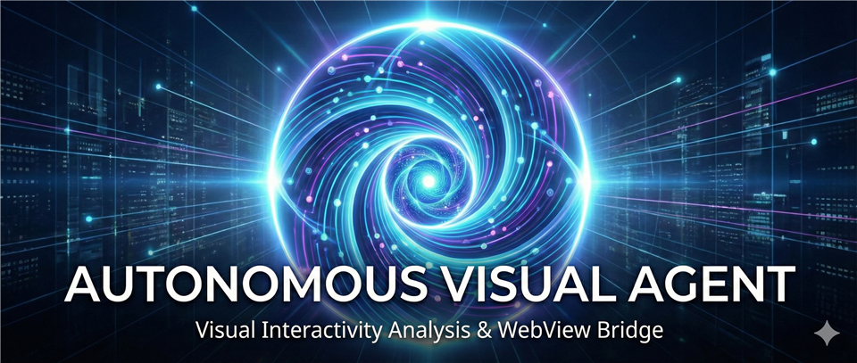
</p>

<p align="center">
  
</p>

<h1 align="center">WebView Bridge</h1>

<p align="center">
  <strong>第3世代 AI ブラウザ自動化 — Visual Interactivity Analysis</strong><br>
  <sub>AI が「見て」「判断して」「操作する」、人間と同じ方法でブラウザを使う MCP サーバー</sub>
</p>

<p align="center">
  
  
  
  
  
</p>

---

## なぜ WebView Bridge なのか

既存のブラウザ自動化ツール (Playwright MCP, Anthropic Computer Use 等) は、**DOM 解析**や**スクリーンショットの丸投げ**に依存しています。サイト構造が変わればセレクタが壊れ、LLM に画像を送れば推論コストが膨張する — これが従来の限界でした。

WebView Bridge は、この問題を根本から解決します。

### AI エージェントの進化：第3世代への到達

| 世代 | アプローチ | 代表例 | 課題 |
|:---:|:---|:---|:---|
| **第1世代** | スクリプト型 (CSS セレクタ依存) | Selenium / Puppeteer | 脆弱・保守コスト大 |
| **第2世代** | LLM + DOM | 既存 MCP ツール | LLM 依存度高・高遅延 |
| **第3世代** | **自律視覚型** | **WebView Bridge** | MCP 側で視覚判断、LLM 負荷を削減 |

<p align="center">
  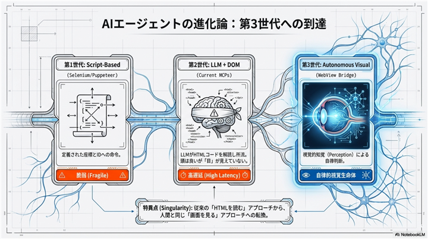
</p>

---

## 3つの技術革新

### 革新 1 — Visual Interactivity Analysis (視覚的インタラクティビティ分析)

HTML を LLM に丸投げしない。MCP サーバー側でページを**視覚的にスコアリング**し、エージェント自身が「操作可能性」を判断します。

- セレクタ推測 (Selector Guessing) を排除
- スコアリングヒートマップでクリック可能な領域を自動検出
- DOM 構造に依存しないため、サイトの UI 変更に強い

<p align="center">
  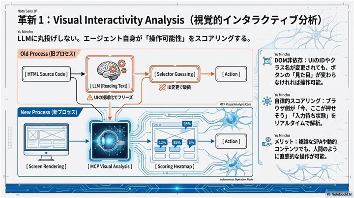
</p>

### 革新 2 — セッションの相乗り (Persistent Browser Sessions)

毎回ブラウザを立ち上げ直すのではなく、**ユーザーの実ブラウザセッションに AI が相乗り**します。

- Cookie・ログイン状態が永続化 — 毎回ログインし直す必要なし
- WebView2 常時起動 + 永続プロファイル — ユーザーの「手」と「目」としてシームレスに動作
- セッションのクローン・切り替えで複数タスクを並行処理

<p align="center">
  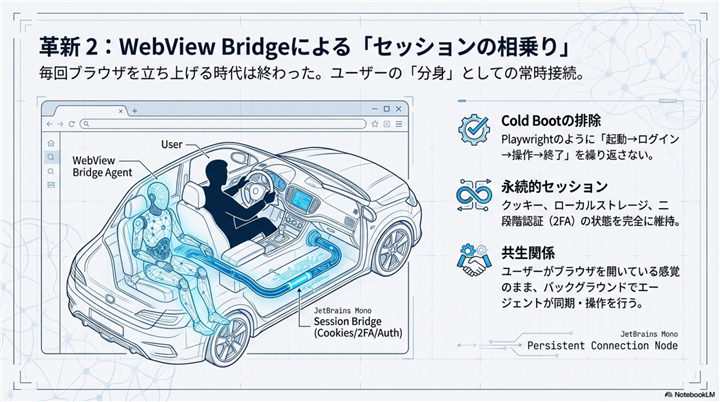
</p>

### 革新 3 — 自己修復とボット防御 (Visual Change Detection)

異常を「視覚」で検知し、自律的に回避行動をとる生存本能。

- CAPTCHA 出現を画面変化から自動検出
- レイアウト崩れ → 自己修復 (Self-Healing)
- `human_mode` でベジェ曲線のマウス移動・タイプミス・ランダム遅延を再現

<p align="center">
  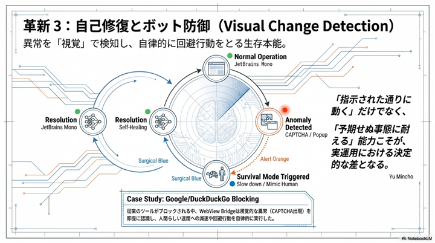
</p>

---

## 競合との比較

| 比較項目 | 既存 MCP (Playwright等) | Anthropic Computer Use | **WebView Bridge** |
|:---|:---|:---|:---|
| **操作ロジック** | DOM (セレクタ) 依存 | 画面 + スクリーンショット | **Visual Interactivity Analysis** |
| **判断主体** | LLM が都度推論 | LLM が都度推論 | **MCP 側で操作可能性をスコアリング** |
| **セッション維持** | 単発実行が基本 | 単発実行が基本 | **WebView2 常時起動 + 永続ログイン** |
| **ボット対策** | なし (検知されやすい) | 人間らしさは有り | **自律的 CAPTCHA 対応 + 自己復旧** |
| **推論コスト** | 高 (都度 LLM 往復) | 高 (画像を毎回送信) | **低 (MCP 側で前処理)** |

<p align="center">
  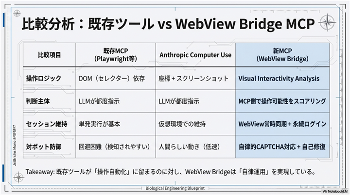
  <br>
  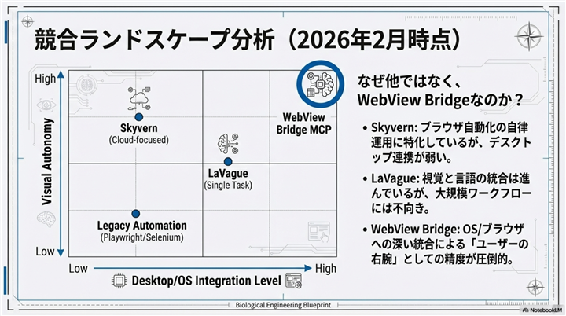
</p>

---

## 新しい共生関係 — AI はツールではなく、拡張された「手」になる

WebView Bridge が目指すのは、人間がスクリプトを書き、機械に流し込む一方的な自動化ではありません。**人間のデジタルライフに AI エージェントが寄り添う「共生関係」**を構築することです。

<p align="center">
  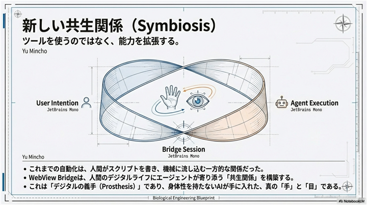
</p>

### 開発者にとっての実利

- **推論コスト削減** — MCP 側で視覚判断を行うため、LLM への無駄な往復を削減
- **高い生存率** — 「壊れたら止まる」のではなく「自分で見て、自分で判断して動く」
- **実用レベルのアプリケーション開発が可能に** — PoC 止まりではない、本番運用できる AI ブラウザ操作

<p align="center">
  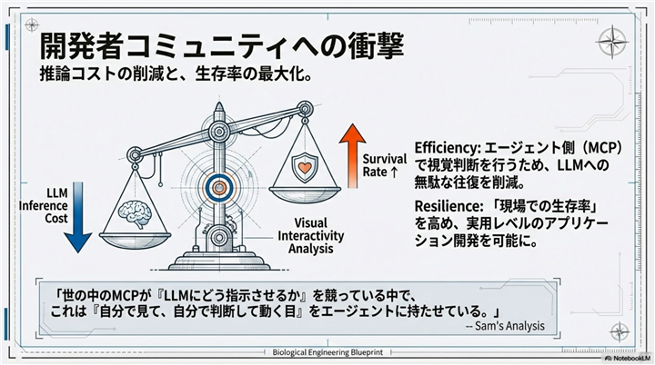
</p>

---

## 機能一覧

- ブラウザセッションの作成・管理 (Cookie 永続化)
- ページ遷移・クリック・入力・スクロール
- スクリーンショット・DOM キャプチャ
- 構造化データ抽出
- ネットワーク監視
- AI による自律ブラウジング (Agentic モード)
- システムトレイ常駐・バックグラウンド動作

---

## ダッシュボード

ブラウザで `http://localhost:9400` にアクセスすると、管理ダッシュボードが表示されます。

### メイン画面

セッション数・AI 状態・スクリーンショット数などの概要を一覧表示。


### セッション管理

ブラウザセッションの新規作成・起動・クローン・削除。Cookie はセッション間で永続化されます。


### AI 設定

LLM プロバイダー (Ollama / Google Gemini) の設定。ページ要約や自律操作に使用します。

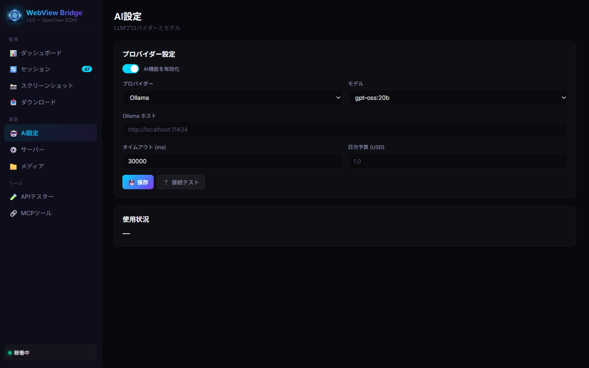

### サーバー設定

HTTP サーバーのバインドアドレス・ポート・最大セッション数・デフォルトビューポートなどの設定。

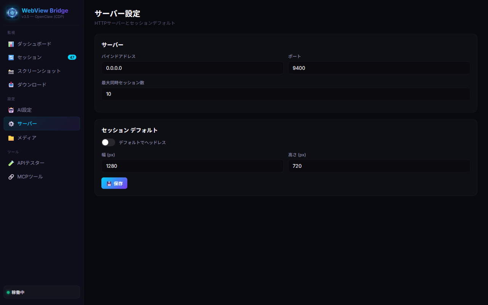

### MCP ツール一覧

利用可能な 9 つの MCP ツールとそのパラメータを確認できます。

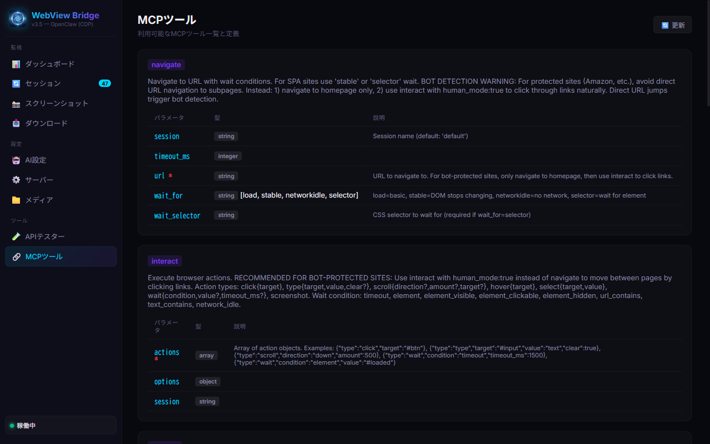

---

## インストール

### インストーラー (推奨)

1. [Releases](https://github.com/mhit/webview-bridge-release/releases) から `WebViewBridge-3.5.0-Setup.exe` をダウンロード
2. インストーラーを実行
3. インストール完了後、自動的にシステムトレイに常駐

### 前提条件

- **Windows 10/11** (64-bit)
- **WebView2 Runtime** - 通常 Microsoft Edge と共にインストール済み。未インストールの場合、インストーラが `winget` 経由で自動インストールを試みます。

---

## 使い方

### 起動

インストーラーでインストールした場合、スタートメニューまたはデスクトップのショートカットから起動できます。
起動するとシステムトレイにアイコンが表示されます。

- **右クリック → ダッシュボードを開く**: ブラウザでダッシュボードを表示
- **右クリック → 終了**: サーバーを停止

### コマンドラインオプション

```
webview-bridge-rust.exe [OPTIONS]

Options:
  --bind <IP>       バインドアドレス (デフォルト: 0.0.0.0)
  --port <PORT>     ポート番号 (デフォルト: 9400)
  --help, -h        ヘルプを表示
```

---

## MCP クライアント設定

### Claude Desktop / Cline / その他 MCP クライアント

MCP 設定ファイルに以下を追加してください:

#### HTTP (StreamableHTTP) 接続 — 推奨

```json
{
  "mcpServers": {
    "webview-bridge": {
      "serverUrl": "http://127.0.0.1:9400/mcp"
    }
  }
}
```

#### stdio 接続

```json
{
  "mcpServers": {
    "webview-bridge": {
      "command": "webview-bridge-rust.exe",
      "args": ["--mcp-stdio"]
    }
  }
}
```

> **Note**: stdio 接続の場合、exe のパスを PATH に通すか、フルパスで指定してください。

---

## MCP ツール

| ツール | 説明 |
|--------|------|
| `session` | セッション管理 (作成・削除・一覧・Cookie インポート) |
| `navigate` | URL 遷移 (load/stable/networkidle/selector 待機) |
| `interact` | ブラウザ操作 (click/type/scroll/hover/select/wait) |
| `capture` | ページ状態キャプチャ (スクリーンショット・DOM・要素一覧) |
| `extract` | 構造化データ抽出 (CSS セレクタベース) |
| `execute` | JavaScript 実行 |
| `media` | メディア操作 (YouTube ダウンロード・画像収集) |
| `agent` | AI 自律ブラウジング (ゴールベース) |
| `network` | ネットワーク監視 (リクエスト/レスポンスキャプチャ) |

### 使用例

#### ページ遷移 + スクリーンショット

```json
// 1. セッション作成
{"tool": "session", "acquire": "demo"}

// 2. ページ遷移
{"tool": "navigate", "session": "demo", "url": "https://example.com", "wait_for": "stable"}

// 3. スクリーンショット取得
{"tool": "capture", "session": "demo", "screenshot": true}
```

#### 検索操作 (複数アクション)

```json
{
  "tool": "interact",
  "session": "demo",
  "actions": [
    {"type": "type", "target": "textarea[name=q]", "value": "WebView Bridge"},
    {"type": "click", "target": "input[name=btnK]"},
    {"type": "wait", "condition": "network_idle", "timeout_ms": 5000}
  ]
}
```

#### Bot 検知対策 (human_mode)

```json
{
  "tool": "interact",
  "session": "demo",
  "actions": [
    {"type": "click", "target": "a.product-link"}
  ],
  "options": {"human_mode": true}
}
```

> `human_mode: true` を指定すると、ベジェ曲線のマウス移動・タイプミス・ランダム遅延で人間らしい操作を行います。

---

## config.toml

データディレクトリ (`%APPDATA%\webview-bridge\`) に `config.toml` を配置することで設定をカスタマイズできます。
インストーラーがサンプルを自動生成します。

```toml
[server]
bind = "0.0.0.0"
port = 9400
max_sessions = 10

[ai]
enabled = false
provider = "ollama"       # "ollama" or "gemini"
model = "gemma3:12b"      # Ollama のモデル名
# api_key = "your-key"    # Gemini 使用時に必要
# timeout_ms = 30000
# daily_budget_usd = 1.0

[session]
# default_ttl_hours = 168  # セッション有効期間 (デフォルト: 1週間)

[media]
# download_dir = "downloads"
```

---

## REST API

MCP 経由でなく、REST API を直接利用することもできます。

```bash
# ヘルスチェック
curl http://localhost:9400/health

# セッション作成
curl -X POST http://localhost:9400/session/acquire \
  -H "Content-Type: application/json" \
  -d '{"name": "my-session"}'

# セッション一覧
curl http://localhost:9400/session/list

# MCP ツール呼び出し
curl -X POST http://localhost:9400/mcp \
  -H "Content-Type: application/json" \
  -d '{"tool": "navigate", "session": "my-session", "url": "https://example.com"}'
```

---

## アンインストール

1. システムトレイのアイコンを右クリック → **終了**
2. Windows の **設定 → アプリ → WebView Bridge** からアンインストール
3. アンインストーラーで「セッションデータも削除」を選択すると Cookie 等も削除されます

---

## ライセンス

MIT License

---

<p align="center">
  <sub>Built with Rust + WebView2 + CDP — 第3世代 AI ブラウザ自動化エンジン</sub>
</p>
