<p align="center">
  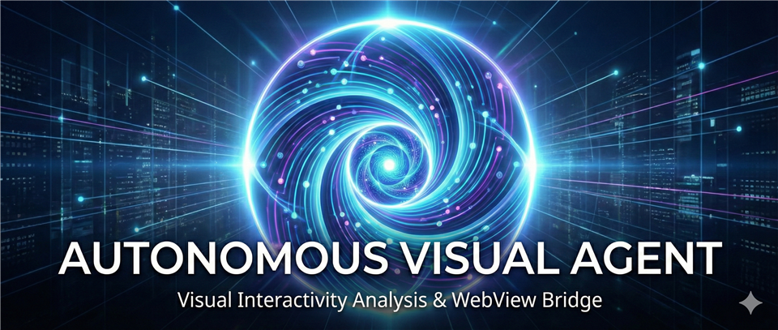
</p>

<p align="center">
  
</p>

<h1 align="center">WebView Bridge</h1>

<p align="center">
  <strong>第3世代 AI ブラウザ自動化 — Visual Interactivity Analysis</strong><br>
  <sub>AI が「見て」「判断して」「操作する」、人間と同じ方法でブラウザを使う MCP サーバー</sub>
</p>

<p align="center">
  
  
  
  
  
  
</p>

---

## なぜ WebView Bridge なのか

既存のブラウザ自動化ツール (Playwright MCP, Anthropic Computer Use 等) は、**DOM 解析**や**スクリーンショットの丸投げ**に依存しています。サイト構造が変わればセレクタが壊れ、LLM に画像を送れば推論コストが膨張する — これが従来の限界でした。

WebView Bridge は、この問題を根本から解決します。

### AI エージェントの進化：第3世代への到達

| 世代 | アプローチ | 代表例 | 課題 |
|:---:|:---|:---|:---|
| **第1世代** | スクリプト型 (CSS セレクタ依存) | Selenium / Puppeteer | 脆弱・保守コスト大 |
| **第2世代** | LLM + DOM | 既存 MCP ツール | LLM 依存度高・高遅延 |
| **第3世代** | **自律視覚型** | **WebView Bridge** | MCP 側で視覚判断、LLM 負荷を削減 |

<p align="center">
  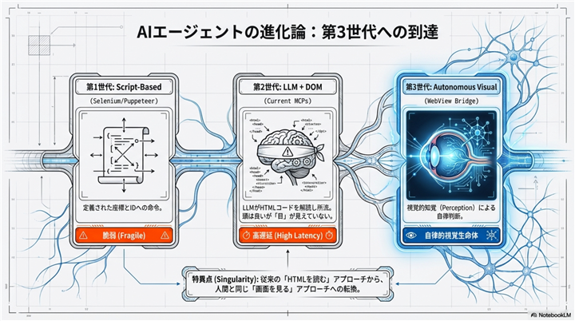
</p>

---

## 3つの技術革新

### 革新 1 — Visual Interactivity Analysis (視覚的インタラクティビティ分析)

HTML を LLM に丸投げしない。MCP サーバー側でページを**視覚的にスコアリング**し、エージェント自身が「操作可能性」を判断します。

- セレクタ推測 (Selector Guessing) を排除
- スコアリングヒートマップでクリック可能な領域を自動検出
- DOM 構造に依存しないため、サイトの UI 変更に強い

<p align="center">
  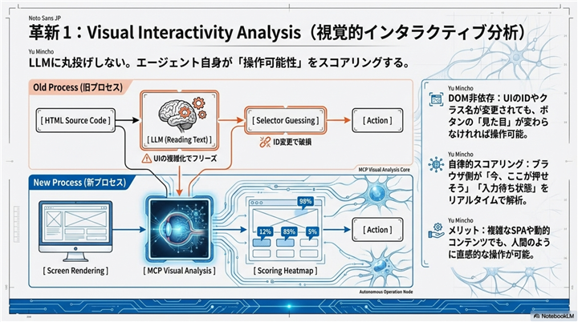
</p>

### 革新 2 — セッションの相乗り (Persistent Browser Sessions)

毎回ブラウザを立ち上げ直すのではなく、**ユーザーの実ブラウザセッションに AI が相乗り**します。

- Cookie・ログイン状態が永続化 — 毎回ログインし直す必要なし
- WebView2 常時起動 + 永続プロファイル — ユーザーの「手」と「目」としてシームレスに動作
- セッションのクローン・切り替えで複数タスクを並行処理

<p align="center">
  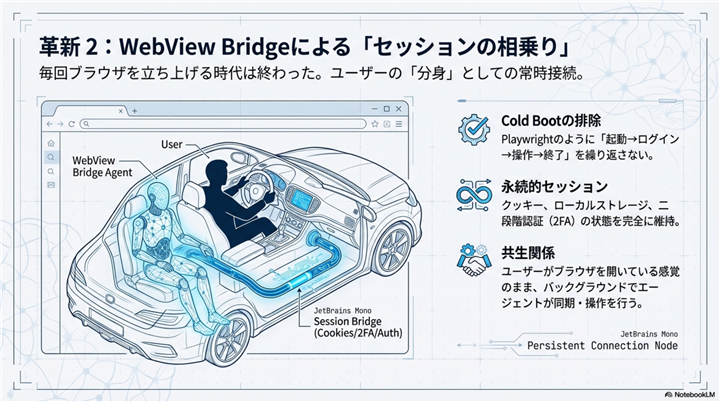
</p>

### 革新 3 — 自己修復とボット防御 (Visual Change Detection)

異常を「視覚」で検知し、自律的に回避行動をとる生存本能。

- CAPTCHA 出現を画面変化から自動検出
- レイアウト崩れ → 自己修復 (Self-Healing)
- `human_mode` でベジェ曲線のマウス移動・タイプミス・ランダム遅延を再現

<p align="center">
  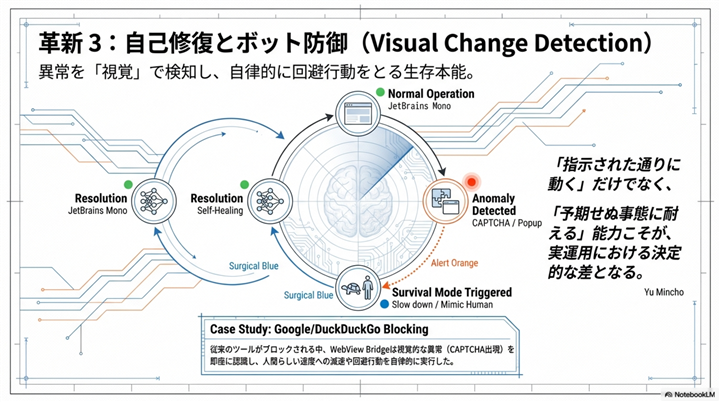
</p>

---

## 競合との比較

| 比較項目 | 既存 MCP (Playwright等) | Anthropic Computer Use | **WebView Bridge** |
|:---|:---|:---|:---|
| **操作ロジック** | DOM (セレクタ) 依存 | 画面 + スクリーンショット | **Visual Interactivity Analysis** |
| **判断主体** | LLM が都度推論 | LLM が都度推論 | **MCP 側で操作可能性をスコアリング** |
| **セッション維持** | 単発実行が基本 | 単発実行が基本 | **WebView2 常時起動 + 永続ログイン** |
| **ボット対策** | なし (検知されやすい) | 人間らしさは有り | **自律的 CAPTCHA 対応 + 自己復旧** |
| **推論コスト** | 高 (都度 LLM 往復) | 高 (画像を毎回送信) | **低 (MCP 側で前処理)** |
| **CLI** | なし | なし | **クロスプラットフォーム CLI (`wb`)** |
| **iframe 操作** | 制限あり | 制限あり | **CDP ベースの完全な iframe サポート** |

<p align="center">
  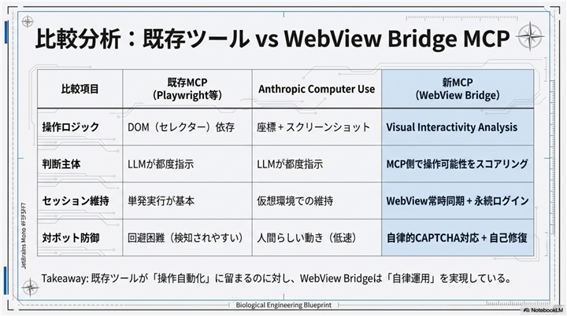
  <br>
  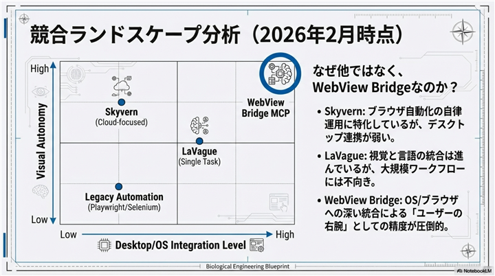
</p>

---

## 新しい共生関係 — AI はツールではなく、拡張された「手」になる

WebView Bridge が目指すのは、人間がスクリプトを書き、機械に流し込む一方的な自動化ではありません。**人間のデジタルライフに AI エージェントが寄り添う「共生関係」**を構築することです。

<p align="center">
  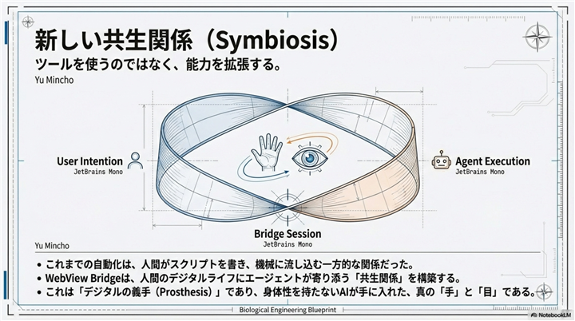
</p>

### 開発者にとっての実利

- **推論コスト削減** — MCP 側で視覚判断を行うため、LLM への無駄な往復を削減
- **高い生存率** — 「壊れたら止まる」のではなく「自分で見て、自分で判断して動く」
- **実用レベルのアプリケーション開発が可能に** — PoC 止まりではない、本番運用できる AI ブラウザ操作

<p align="center">
  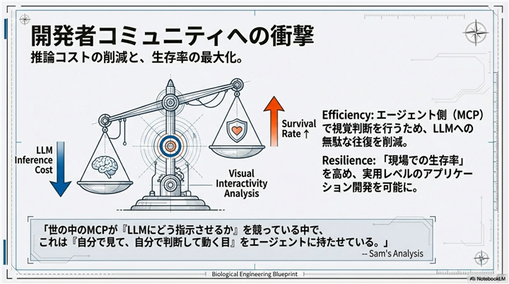
</p>

---

## 機能一覧

- ブラウザセッションの作成・管理 (Cookie 永続化)
- ページ遷移・クリック・入力・スクロール
- スクリーンショット・DOM キャプチャ
- 構造化データ抽出
- ネットワーク監視 (リクエスト/レスポンスキャプチャ)
- CDP iframe サポート (フレーム内要素の操作・キャプチャ)
- AI による自律ブラウジング (Agentic モード)
- システムトレイ常駐・バックグラウンド動作
- **`wb` CLI** — トークン効率型のクロスプラットフォーム CLI (Windows / Linux / macOS)
- 自動アップデート (`wb update`)

---

## ダッシュボード

ブラウザで `http://localhost:9400` にアクセスすると、管理ダッシュボードが表示されます。

### メイン画面

セッション数・AI 状態・スクリーンショット数などの概要を一覧表示。

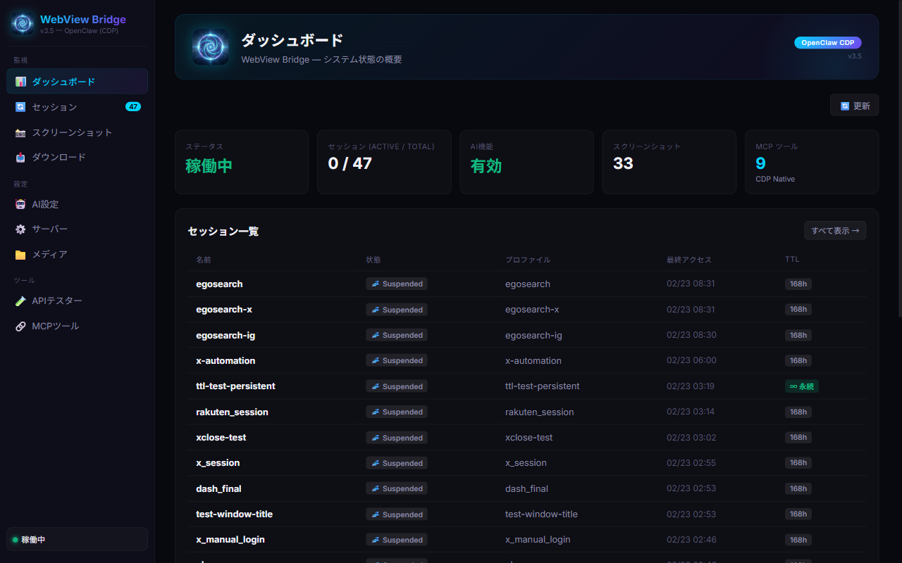

### セッション管理

ブラウザセッションの新規作成・起動・クローン・削除。Cookie はセッション間で永続化されます。

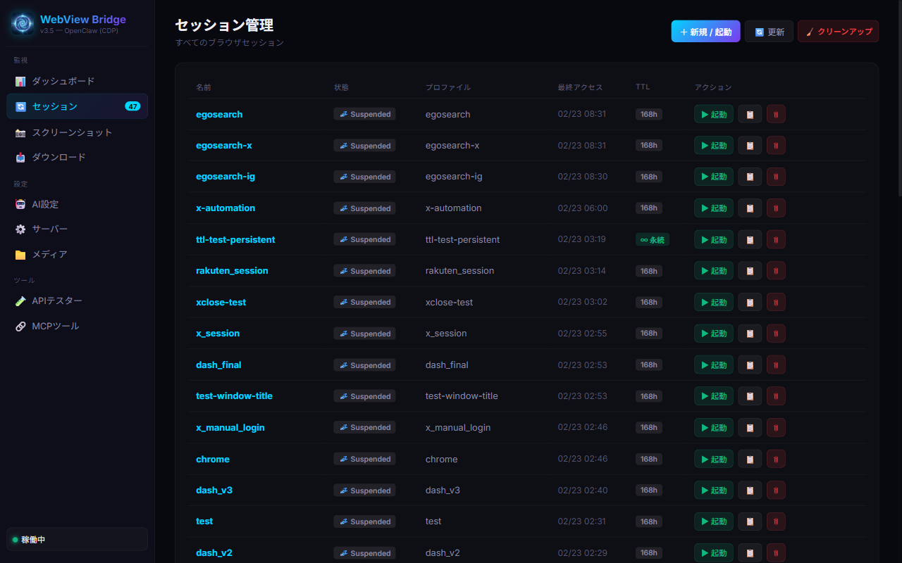

### AI 設定

LLM プロバイダー (Ollama / Google Gemini) の設定。ページ要約や自律操作に使用します。

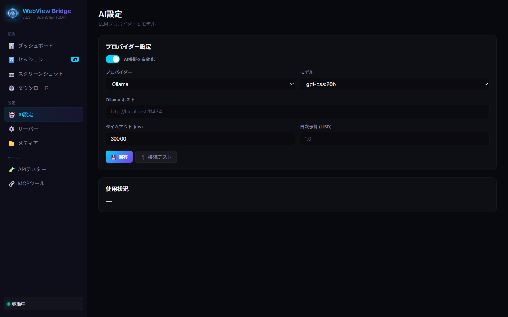

### サーバー設定

HTTP サーバーのバインドアドレス・ポート・最大セッション数・デフォルトビューポートなどの設定。

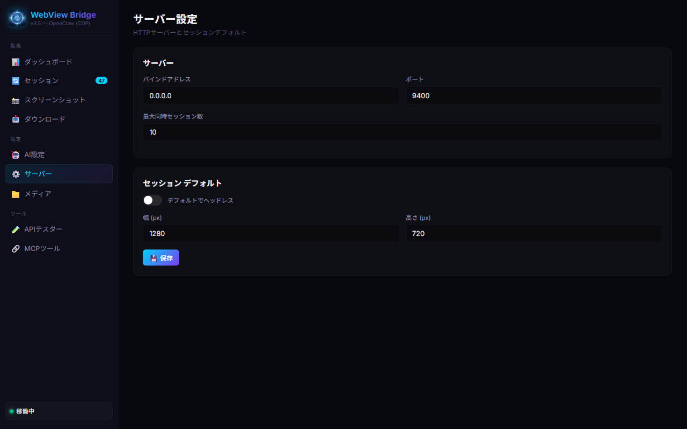

### MCP ツール一覧

利用可能な MCP ツールとそのパラメータを確認できます。

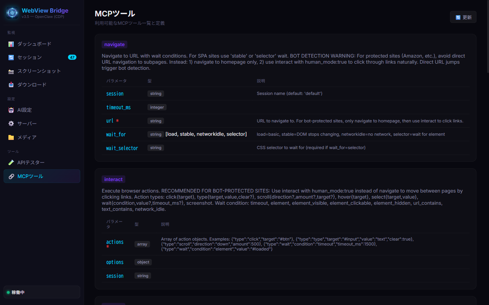

---

## インストール

### インストーラー (推奨)

1. [Releases](https://github.com/mhit/webview-bridge-release/releases) から最新の `WebViewBridge-Setup.exe` をダウンロード
2. インストーラーを実行
3. インストール完了後、自動的にシステムトレイに常駐

### 前提条件

- **Windows 10/11** (64-bit) — サーバー
- **WebView2 Runtime** — 通常 Microsoft Edge と共にインストール済み。未インストールの場合、インストーラが `winget` 経由で自動インストールを試みます。

---

## wb CLI

`wb` は WebView Bridge のクロスプラットフォーム CLI です。MCP を使わずに、ターミナルから直接ブラウザを操作できます。AI エージェントのツールチェーンとしても最適化されています。

### インストール

[Releases](https://github.com/mhit/webview-bridge-release/releases) からプラットフォームに対応するバイナリをダウンロード:

| プラットフォーム | バイナリ名 |
|---|---|
| Windows | `wb-windows.exe` |
| Linux (x86_64) | `wb-linux` |
| macOS (Apple Silicon) | `wb-macos` |

ダウンロード後、PATH の通った場所に `wb` としてリネーム配置してください。

```bash
# Linux / macOS
chmod +x wb-linux
mv wb-linux ~/.local/bin/wb

# Windows (PowerShell)
Rename-Item wb-windows.exe wb.exe
# wb.exe を PATH の通ったディレクトリに配置
```

### 初期設定

```bash
# サーバーの認証トークンを保存 (サーバー起動時にコンソールに表示される)
wb auth save <TOKEN>

# リモートサーバーに接続する場合
wb --host http://192.168.1.100:9400 status
# または環境変数で指定
export WB_HOST=http://192.168.1.100:9400
export WB_TOKEN=<TOKEN>
```

### コマンド一覧

| コマンド | 説明 | 例 |
|---|---|---|
| `wb status` | サーバーの稼働状態とセッション一覧 | `wb status` |
| `wb session acquire` | セッションを作成/再利用 | `wb session acquire mysite` |
| `wb session release` | セッションを解放 | `wb session release mysite` |
| `wb session list` | 全セッション一覧 | `wb session list` |
| `wb open` | URL に遷移 | `wb open https://example.com -s mysite` |
| `wb snapshot` | ページの操作可能要素をテキスト表示 | `wb snapshot -s mysite` |
| `wb click` | 要素をクリック | `wb click e3 -s mysite` |
| `wb type` | テキストを入力 | `wb type e5 "検索テキスト" -s mysite` |
| `wb screenshot` | スクリーンショットを保存 | `wb screenshot -s mysite` |
| `wb execute` | JavaScript を実行 | `wb execute "document.title" -s mysite` |
| `wb scroll` | ページをスクロール | `wb scroll down -s mysite` |
| `wb wait` | 要素/条件を待機 | `wb wait "#result" -s mysite` |
| `wb select` | ドロップダウンを選択 | `wb select e7 "Tokyo" -s mysite` |
| `wb extract` | 構造化データを抽出 | `wb extract ".item" -F "name=h3,price=.cost"` |
| `wb frames` | ページ内の全 iframe を一覧 | `wb frames -s mysite` |
| `wb cookies get` | Cookie を取得 | `wb cookies get -s mysite` |
| `wb cookies set` | Cookie を設定 | `wb cookies set cookies.json -s mysite` |
| `wb cookies import` | ブラウザから Cookie をインポート | `wb cookies import -b chrome -d example.com` |
| `wb auth save` | 認証トークンを保存 | `wb auth save abc123` |
| `wb update` | CLI を最新版に更新 | `wb update` |

### スナップショットと要素参照 (e1, e2...)

`wb snapshot` はページの操作可能要素をトークン効率の良いテキスト形式で表示します。各要素に `e1`, `e2`, `e3`... の参照IDが付与され、後続のコマンドでそのまま使えます。

```bash
$ wb snapshot -s demo
[e1] link "Home" href="/"
[e2] link "About" href="/about"
[e3] button "Search"
[e4] input[type=text] placeholder="Search..."
[e5] link "Login" href="/login"

$ wb click e3 -s demo        # e3 (Search ボタン) をクリック
$ wb type e4 "AI" -s demo    # e4 (検索ボックス) にテキスト入力
```

### iframe 操作 (`--frame`)

`--frame` フラグで iframe 内の要素を操作できます。URL の一部、フレーム名、またはフレームIDで指定します。

```bash
# iframe 一覧を確認
$ wb frames -s demo
[0] "ad-frame" https://ads.example.com/banner
[1] "content" https://embed.example.com/widget

# iframe 内のスナップショットを取得
$ wb snapshot -s demo --frame "embed.example"

# iframe 内の要素をクリック
$ wb click e2 -s demo --frame "content"

# iframe のスクリーンショットを取得
$ wb screenshot -s demo --frame "content"
```

### グローバルフラグ

| フラグ | 環境変数 | 説明 |
|---|---|---|
| `--host <URL>` | `WB_HOST` | サーバーアドレス (デフォルト: `http://127.0.0.1:9400`) |
| `--token <TOKEN>` | `WB_TOKEN` | Bearer 認証トークン |
| `--json` | — | JSON 形式で出力 |
| `--quiet` / `-q` | — | ファイルパスのみ出力 |
| `--no-file` | — | ファイル保存せず stdout に出力 |
| `--no-update-check` | `WB_NO_UPDATE_CHECK` | 起動時の自動アップデートチェックを無効化 |

### 自動アップデート

`wb` は起動時にバックグラウンドで最新バージョンをチェックします (24時間キャッシュ)。新しいバージョンがある場合、stderr に通知が表示されます。

```bash
# 手動でアップデート
$ wb update
Current: v3.8.0 → Latest: v3.9.0
Downloading wb-v3.9.0-x86_64-unknown-linux-gnu... 4.2 MB
Updated successfully! Restart to use v3.9.0.

# チェックのみ (ダウンロードしない)
$ wb update --check
```

---

## サーバー起動

### GUI (推奨)

インストーラーでインストールした場合、スタートメニューまたはデスクトップのショートカットから起動できます。
起動するとシステムトレイにアイコンが表示されます。

- **右クリック → ダッシュボードを開く**: ブラウザでダッシュボードを表示
- **右クリック → 終了**: サーバーを停止

### コマンドライン

```
webview-bridge-rust.exe [OPTIONS]

Options:
  --bind <IP>       バインドアドレス (デフォルト: config.toml の値 or 127.0.0.1)
  --port <PORT>     ポート番号 (デフォルト: config.toml の値 or 9400)
  --no-auth         認証を無効化
  --mcp-stdio       MCP stdio モードで起動 (サーバーなし)
  --help, -h        ヘルプを表示
```

### 認証

サーバー起動時に 32 文字のランダムな Bearer トークンが生成され、コンソールに表示されます。すべての API リクエストにこのトークンが必要です。

```bash
# config.toml で無効化する場合
[server]
no_auth = true

# またはコマンドラインで
webview-bridge-rust.exe --no-auth
```

---

## MCP クライアント設定

### Claude Desktop / Cline / その他 MCP クライアント

MCP 設定ファイルに以下を追加してください:

#### HTTP (StreamableHTTP) 接続 — 推奨

```json
{
  "mcpServers": {
    "webview-bridge": {
      "serverUrl": "http://127.0.0.1:9400/mcp"
    }
  }
}
```

#### stdio 接続

```json
{
  "mcpServers": {
    "webview-bridge": {
      "command": "webview-bridge-rust.exe",
      "args": ["--mcp-stdio"]
    }
  }
}
```

> **Note**: stdio 接続の場合、exe のパスを PATH に通すか、フルパスで指定してください。

---

## MCP ツール

| ツール | 説明 |
|--------|------|
| `session` | セッション管理 (作成・削除・一覧・クローン・Cookie インポート・デバイスエミュレーション) |
| `navigate` | URL 遷移 (load/stable/networkidle/selector 待機) |
| `interact` | ブラウザ操作 (click/type/scroll/hover/select/wait、`--frame` 対応) |
| `capture` | ページ状態キャプチャ (スクリーンショット・DOM・要素一覧、`--frame` 対応) |
| `extract` | 構造化データ抽出 (CSS セレクタベース、`--frame` 対応) |
| `execute` | JavaScript 実行 (`--frame` 対応) |
| `media` | メディア操作 (YouTube ダウンロード・画像収集) |
| `agent` | AI 自律ブラウジング (ゴールベース) |
| `network` | ネットワーク監視 (リクエスト/レスポンスキャプチャ) |

### 使用例

#### ページ遷移 + スクリーンショット

```json
// 1. セッション作成
{"tool": "session", "acquire": "demo"}

// 2. ページ遷移
{"tool": "navigate", "session": "demo", "url": "https://example.com", "wait_for": "stable"}

// 3. スクリーンショット取得
{"tool": "capture", "session": "demo", "screenshot": true}
```

#### 検索操作 (複数アクション)

```json
{
  "tool": "interact",
  "session": "demo",
  "actions": [
    {"type": "type", "target": "textarea[name=q]", "value": "WebView Bridge"},
    {"type": "click", "target": "input[name=btnK]"},
    {"type": "wait", "condition": "network_idle", "timeout_ms": 5000}
  ]
}
```

#### Bot 検知対策 (human_mode)

```json
{
  "tool": "interact",
  "session": "demo",
  "actions": [
    {"type": "click", "target": "a.product-link"}
  ],
  "options": {"human_mode": true}
}
```

> `human_mode: true` を指定すると、ベジェ曲線のマウス移動・タイプミス・ランダム遅延で人間らしい操作を行います。

#### iframe 内の操作

```json
{
  "tool": "interact",
  "session": "demo",
  "actions": [
    {"type": "click", "target": "button.submit"}
  ],
  "frame": "embed.example.com"
}
```

---

## config.toml

データディレクトリ (`%APPDATA%\webview-bridge\`) に `config.toml` を配置することで設定をカスタマイズできます。
インストーラーがサンプルを自動生成します。

```toml
[server]
bind = "127.0.0.1"        # バインドアドレス
port = 9400                # ポート番号
max_sessions = 10          # 最大同時セッション数
no_auth = false            # true で認証を無効化

[ai]
enabled = true
provider = "gemini"        # "gemini" or "ollama"
model = "gemini-1.5-flash" # モデル名
# api_key = "your-key"     # Gemini 使用時に必要
# ollama_host = "http://localhost:11434"
# timeout_ms = 30000
# daily_budget_usd = 1.0

[session]
default_headless = false   # ヘッドレスモード
default_width = 1280       # デフォルトウィンドウ幅
default_height = 720       # デフォルトウィンドウ高さ
timeout_seconds = 0        # セッションタイムアウト (0=無制限)
persist_profiles = true    # プロファイルの永続化

[media]
# download_dir = "path"            # ダウンロード保存先
# screenshots_dir = "path"         # スクリーンショット保存先
# max_download_size = 0            # 最大ダウンロードサイズ (0=無制限)
default_video_quality = "hd"       # 動画品質 (best/hd/sd/low)
```

### データディレクトリ構造

```
%APPDATA%\webview-bridge\
├── config.toml              設定ファイル
├── sessions.json            セッション永続化メタデータ
├── profiles/
│   └── {profile_name}/
│       ├── (WebView2 userdata)  ブラウザデータ (Cookie, Cache)
│       └── screenshots/         スクリーンショット保存
├── downloads/               ダウンロード出力
├── subtitles/               字幕抽出出力
└── analysis/                動画分析出力
```

環境変数 `WEBVIEW_BRIDGE_DATA_PATH` でデータディレクトリを変更できます。

---

## REST API

MCP 経由でなく、REST API を直接利用することもできます。認証が有効な場合は `Authorization: Bearer <TOKEN>` ヘッダーが必要です。

```bash
# ヘルスチェック (認証不要)
curl http://localhost:9400/health

# セッション作成
curl -X POST http://localhost:9400/session/acquire \
  -H "Authorization: Bearer YOUR_TOKEN" \
  -H "Content-Type: application/json" \
  -d '{"name": "my-session"}'

# セッション一覧
curl http://localhost:9400/session/list \
  -H "Authorization: Bearer YOUR_TOKEN"

# スクリーンショット
curl -X POST http://localhost:9400/screenshot \
  -H "Authorization: Bearer YOUR_TOKEN" \
  -H "Content-Type: application/json" \
  -d '{"session": "my-session"}'

# iframe 一覧
curl -X POST http://localhost:9400/frames \
  -H "Authorization: Bearer YOUR_TOKEN" \
  -H "Content-Type: application/json" \
  -d '{"session": "my-session"}'
```

---

## アンインストール

1. システムトレイのアイコンを右クリック → **終了**
2. Windows の **設定 → アプリ → WebView Bridge** からアンインストール
3. アンインストーラーで「セッションデータも削除」を選択すると Cookie 等も削除されます

---

## 更新履歴

### v3.9.0
- CDP iframe サポート (`wb frames`, 全コマンドに `--frame` フラグ)
- MCP ツールに `frame` パラメータ追加 (interact, capture, extract, execute)
- エラーメッセージ改善 — 全インターフェース (REST API / MCP / CLI) でアクション可能なガイダンスを追加
- セッション未取得エラーに具体的な解決コマンドを提示
- CLI ヘルプに環境変数一覧 (`WB_HOST`, `WB_TOKEN`, `WB_NO_UPDATE_CHECK`) とクイックスタートガイドを追加

### v3.8.0
- stale セッションの自動復旧 (V1 ヘルスチェック)

### v3.7.x
- `wb update` コマンド (自動アップデート)
- クロスプラットフォーム CLI リリース (Windows / Linux / macOS)
- NSIS Windows インストーラー

### v3.6.0
- 管理ダッシュボード全面刷新
- 認証トグル、セッションクリーンアップ

### v3.5.0
- MCP v3 プロトコル対応
- Visual Interactivity Analysis
- human_mode (ベジェ曲線マウス移動)
- Cookie 永続化セッション

---

## ライセンス

MIT License

---

<p align="center">
  <sub>Built with Rust + WebView2 + CDP — 第3世代 AI ブラウザ自動化エンジン</sub>
</p>
